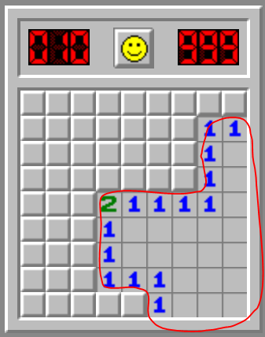
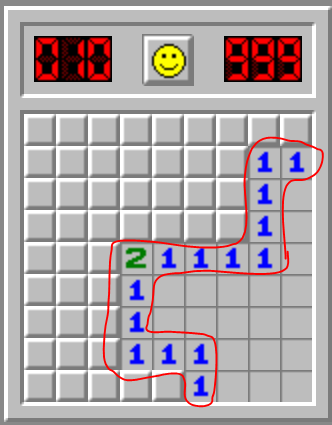

# C Minefield

Seu objetivo neste trabalho é implementar o jogo [campo minado](https://pt.wikipedia.org/wiki/Campo_minado) na linguagem 
de programação C.

Você pode ver o funcionamento do jogo neste link: https://campo-minado.com/

O trabalho deverá ser apresentado ao professor. Durante a apresentação, o processo de desenvolvimento do código-fonte
será discutido. Você será solicitado a fazer pequenas modificações no código-fonte, de maneira que o comportamento do 
jogo seja alterado, e será perguntado dos motivos que levaram a estas alterações.

Portanto, é **fortemente desaconselhado** copiar o código-fonte do jogo campo minado da Internet. Trabalhos plagiados
terão nota zero.

## Requisitos

Abaixo estão elencados os requisitos obrigatórios e opcionais do jogo campo minado, bem como a nota que será dada para
cada um dos itens, caso sejam implementados.

É recomendado implementar todos os requisitos obrigatórios, mas você pode escolher quais requisitos opcionais quer 
implementar. 

A nota máxima deste trabalho é 10, portanto, mesmo que você implemente todas as funcionalidades das listas, sua nota não
ultrapassará 10.

### Obrigatórios

#### Requisitos funcionais

* [ ] **(0.5 pt)** O tamanho do mapa do jogo é variável
* [ ] **(1 pt)** O número de linhas do mapa pode ser diferente do número de colunas
* [ ] **(0.5 pt)** O mapa possui minas
* [ ] **(1 pt)** O jogo se encerra quando o jogador acerta uma mina (condição de derrota)

#### Requisitos não-funcionais

* [ ] **(0.5 pt)** As coordenadas foram implementadas usando `struct`
* [ ] **(0.5 pt)** As células foram implementadas usando `struct`
* [ ] **(1 pt)** **Nenhuma função foi utilizada** (todo o código deve estar na função `main`)

### Opcionais

#### Requisitos funcionais

* [ ] **(1 pt)** É garantido que a primeira jogada não resultará em uma mina (impossível acertar uma mina na primeira 
  jogada)
* [ ] **(1 pt)** O algoritmo de descoberta de mapa foi implementado:

  
      
* [ ] **(1 pt)** Um relógio foi implementado
* [ ] **(1 pt)** [O mapa é colorido](src/cores.c), e uma cor diferente foi usada para cada item (minas, campo, área 
      explorada, números, etc)
* [ ] **(1 pt)** O algoritmo que calcula quantas minas existem perto de uma célula foi implementado:
  
  

* [ ] **(1 pt)** O jogo se encerra quando o jogador descobriu todas as células que **não** possuem minas (condição de 
      vitória)
* [ ] **(1 pt)** Ao perder o jogo, todas as minas são mostradas ao jogador
* [ ] **(1 pt)** É possível fixar e desafixar bandeiras no mapa
  * Uma vez fixada, uma bandeira evita que o usuário acidentalmente selecione aquela posição do mapa para explorar

#### Requisitos não-funcionais

* [ ] **(0.5 pt)** Um `enum` foi utilizado para decidir o tipo da célula (se é mina ou se é campo)
* [ ] **(0.5 pt)** Um tipo foi definido a partir da `struct` de coordenadas (`typedef`)
* [ ] **(0.5 pt)** Um tipo foi definido a partir da `struct` de células (`typedef`)